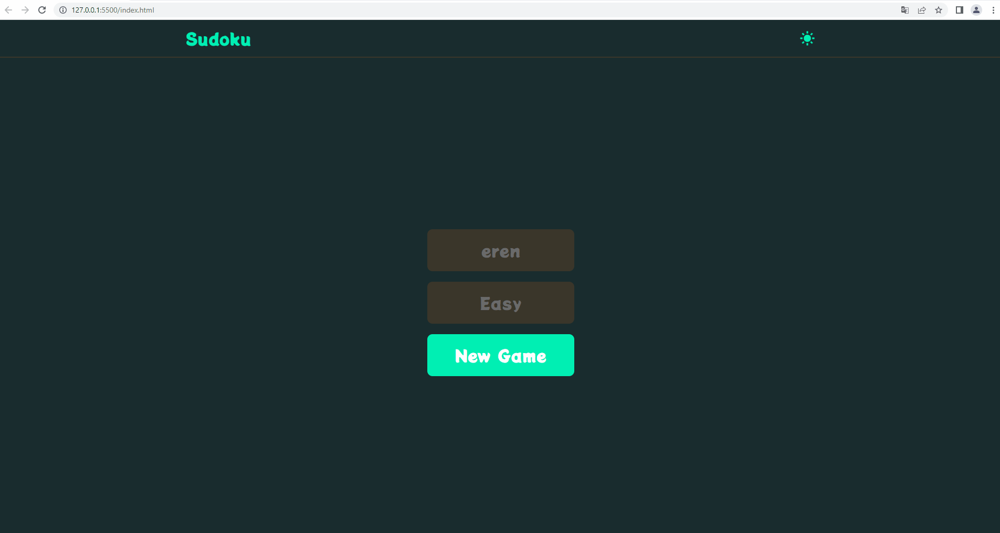

<h1>
 Sudoku Game 
</h1>

Hello,

In this project, I developed the Sudoku game using JavaScript. In its first version, there was a playground with buttons to start and solve, where users could choose from a choice of levels.

However, with the second update, I completed the project and added the game screen and results sections. Users can now play Sudoku in a full-screen playground and see the results at the end of the game. This update has also improved error checks so users can more easily identify and correct incorrectly entered values.

During the project, I made an effort to eliminate code duplication and optimize code structures. In this way, I have increased the code to become more readable and less likely to have errors.

My aim with this project was to enable users to have a more enjoyable experience while playing the Sudoku game. I hope this project will be an interesting and fun experience for Sudoku lovers and maybe inspire them to develop their own projects using JavaScript.

Thank you, good games!

erocode97 

<h1>Used Technologies </h1>
<ul>

<h1>
 Preview 🎥
</h1>

